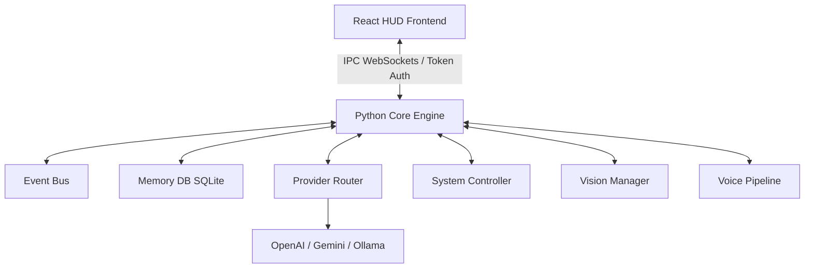

# JARVIS AI OS - System Architecture & API Documentation

This document describes the underlying architecture, modules, and API interfaces of JARVIS AI OS.

---

## 🏗️ Architectural Topology

---

## 🔌 IPC Bridge Interfaces

Communication between the React Electron frontend and the Python backend occurs via a WebSocket server.
* **Default URL**: `ws://127.0.0.1:9876`
* **Security Protocol**: WebSocket handshake parameters require checking a dynamic `?token=<auth_token>` parameter generated inside `.ipc_token`.

### Standard Event Frames (JSON)
1. **ThinkingStarted**: Broadcasted when an agent initiates a task execution loop.
2. **DebugPing**: Pings the status of the connection.
3. **TriggerCommand**: Received from the UI to trigger backend automation actions.

---

## 🚌 Event Bus Subsystem

The EventBus operates as a thread-safe, pub-sub system coordinating backend actions.
* **Topics**:
  * `AIRouteSelected`: Emitted when the provider router selects a model.
  * `ProviderOnline` / `ProviderOffline`: Circuit breaker state updates.
  * `TaskCompleted`: Emitted when an orchestration task succeeds.

---

## 🤖 Agent Framework Namespace

Agents are registered dynamically inside `AgentRegistry`:
* **CoreOrchestrator**: Schedules subtasks, coordinates context params, and checks dependencies.
* **PlannerAgent**: Decomposes prompts using intent rules.
* **SupervisorAgent**: Enforces timeout limits and increments failure retry logs.
