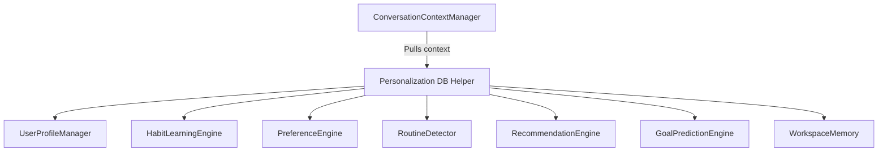

# PERSONALIZATION_DESIGN.md - System Architecture Design

This document details the software architecture, design modules, and components for JARVIS Adaptive Personalization.

---

## 🏗️ Modular Architecture Layout

---

## 🔌 Component Specifications

### 1. UserProfileManager
Saves key-value properties representing preferred LLMs, text-to-speech configuration settings, and favorite tools. Exposes JSON import/export APIs for profile backup migration.

### 2. PreferenceEngine
Computes user score multipliers per recommendation category. Adjusts delta weights based on suggestion feedback actions:
* `ACCEPT`: `+0.15`
* `REJECT`: `-0.25`
* `IGNORE`: `-0.05`

### 3. WorkspaceMemory
Keeps track of active folders, editor layouts, and terminal states to restore layouts after a machine restart.
